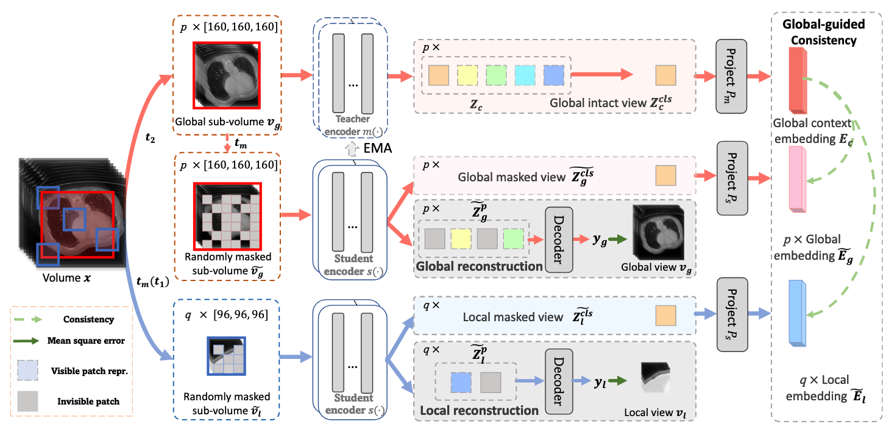
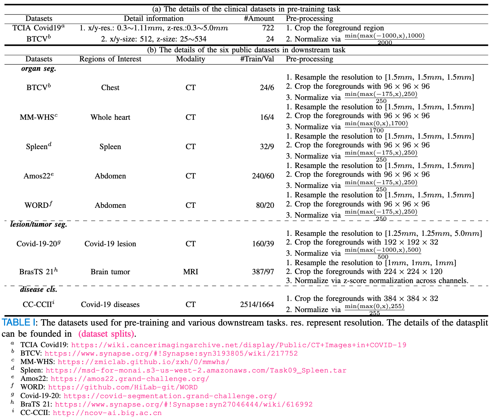

# GL-MAE
---
Official codebase for TMI paper: Advancing volumetric medical image segmentation via global-local masked autoencoders

[](https://arxiv.org/pdf/2306.08913) [](https://ieeexplore.ieee.org/document/11004165)

## News
* [25/07] Stay tuned, we would update the codebase as soon as possible.
* [25/07] Intialize the readme and dataset.

## Abstract
Masked Autoencoder (MAE) is a self-supervised pre-training technique that holds promise in improving the representation learning of neural networks. However, the current application of MAE directly to volumetric medical images poses two challenges: (i) insufficient global information for clinical context understanding of the holistic data, and (ii) the absence of any assurance of stabilizing the representations learned from randomly masked inputs. To conquer these limitations, we propose the Global-Local Masked AutoEncoders (GL-MAE), a simple yet effective selfsupervised pre-training strategy. GL-MAE acquires robust anatomical structure features by incorporating multilevel reconstruction from fine-grained local details to high-level global semantics. Furthermore, a complete global view serves as an anchor to direct anatomical semantic alignment and stabilize the learning process through global-to-global consistency learning and global-to-local consistency learning. Our fine-tuning results on eight mainstream public datasets demonstrate the superiority of our method over other state-of-the-art self-supervised algorithms, highlighting its effectiveness on versatile volumetric medical image segmentation and classification tasks.



## Usage
---
## Load the pretrained weights.
todo: add the pretrained weights and instructions.

## 0. Requirements
* Python 3.8+
* PyTorch 2.0.1
* MONAI 1.0.0
* CUDA 11.8
* cuDNN 8.5
* NVIDIA GPU with compute capability 8.6

## 1. Datasets
Firstly, you need to prepare the pre-training dataset, the ~1k dataset are all open-source and you can download by yourself, or from [huggingface](https://huggingface.co/datasets/Luffy503/VoCo-10k) (Credit to Dr. [Linshan Wu](https://scholar.google.com/citations?hl=en&user=RGPzB4sAAAAJ&inst=1381320739207392350)).

```
├── data
    ├── BTCV
    ├── TCIAcovid19
    ├── Luna-jx
```

The project contains two directories, _i.e.,_
1) Pretrain
2) Finetune


# 2. Pretrain
Wait to update...

# 3. Finetune
Wait to update...

## Reference
If you find this repo useful for your research, please consider citing the paper as follows:
```
@article{zhuang2023advancing,
  title={Advancing volumetric medical image segmentation via global-local masked autoencoder},
  author={Zhuang, Jia-Xin and Luo, Luyang and Chen, Hao},
  journal={IEEE Transactions on Medical Imaging},
  year={2023}
}
```
